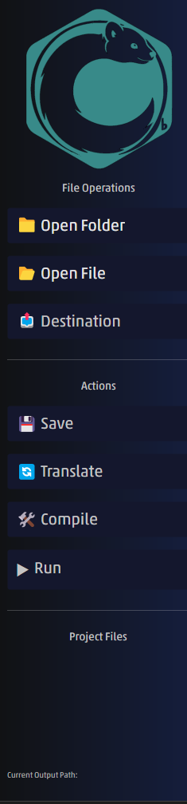
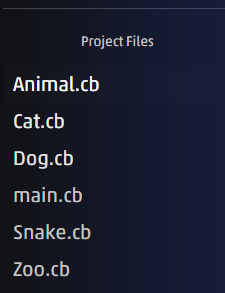
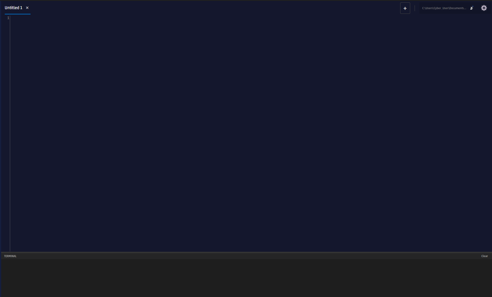

# C♭
## Table of Contents

* [🎹 Syntax](#syntax)
  * [🔢 Types](#types)
  * [⚖️ Conditions](#conditions)
  * [📦 Variables](#variables)
  * [🔄 Loops](#loops)
    * [*While*](#while)
    * [*For*](#for)
  * [📚 Arrays](#arrays)
    * [Declaration](#declaration)
    * [Access](#access)
    * [Slicing](#slicing)
  * [➗ Operations](#operations)
  * [🎤 Functions](#functions)
    * [Signiture](#signiture)
    * [Return](#return)
  * [🎸 Classes](#classes)
    * [Class Signature](#class-signiture)
    * [Access Types](#access-types)
    * [Fields](#fields)
    * [Virtual Types](#virtual-types)
    * [Methodes](#methodes)
    * [Constructors](#constructors)
    * [Static](#static)
  * [🏛️ Usages Of Classes](#usages-of-classes)
    * [Creating an instance](#creating-an-instance)
    * [Geting a **non static** field/methode](#geting-a-non-static-fieldmethode)
    * [Geting a **static** field/methode](#geting-a-static-fieldmethode)
  * [🧩 Other](#other)
    * [toString𝄕𝄇](#tostring)
    * [duration and sub duration (length)](#duration-and-sub-duration-length)
    * [Timbre (is)](#timbre-is)
    * [transcribe (cast)](#transcribe-cast)
    * [Comments](#comments)
* [⚙️ Transposer](#transposer)
  * [Set up](#set-up)
  * [Usage](#usage)
* [✍️ Composer](#composer)
  * [Set up](#set-up)
  * [GUI](#gui)
  * [Composer Shortcuts](#composer-shortcuts)
  * [Charectars Shortcuts](#charectars-shortcuts)
* [🪟 Tranposer Set-Up Windows](#tranposer-set-up-windows)
* [🐧 Tranposer Set-Up Linux](#tranposer-set-up-linux)

---
## 🎹 Syntax
### 🔢 Types
|C♭| C++ |
|--|--|
| degree | int |
| freq| double|
| note| char|
| bar| string|
| mute| bool |
| fermata| void|

 - fermata is only usable in function return value
 - For signed int/char use `flat`.
 - For unsigned int/char use `sharp`.
 - For mute use `demen` as false and `cres` as true. 
 - default values are `""` for bar, `demen` for mute and 0 for the other types.
- Primitive are: `degree`, `freq`, `note` and `mute`
---
### ⚖️ Conditions
|C♭| C++ |
|--|--|
| `D𝄕<condition>𝄇𝄋...𝄌` | `if(<condition>){...}` |
| `D𝄍E𝄕<condition>𝄇𝄋...𝄌` | `else if(<condition>){...}` |
| `E𝄋...𝄌` | `else{...}` |
| `A𝄍<param>𝄋...𝄌` | `Switch(param){...}` |
| `C𝄍<value>𝄋...𝄌` | `case value: ...` |
| `div.` | `or` |
| `non div.` | `and` |
---
### 📦 Variables
To create a variable:
`<type> <name> [= value]`

*If there isn't a value, it uses default values.*

---
### 🔄 Loops
#### *While*
`G𝄕<condition>𝄇𝄋...𝄌`

---
#### *For*
There are **two** types of for
 - Increasing
	 - `Fmaj<starting_value>[♯ inc_value][# stop_value (0 by default)][𝄓param_name]𝄋...𝄌`
 - Decreasing
	 - `Fmin<starting_value>[♭ dec_value][# stop_value (0 by default)][𝄓param_name]𝄋...𝄌`
 - param_name is the name of the for's variable, defaults to be named `i`.
 - starting_value is the value of param_name at the start.
 - inc_value is the value param_name is increasing each iteration **of Fmaj only**, defaults to 1.
 - dec_value is the value param_name is decreasing each iteration **of Fmin only**, defaults to 1.
 - stop_value is the value of param_name where the loops breaks if met the following condition:
	 - When **Fmaj** `param_name < stop_value`
	 - When **Fmin** `param_name >= stop_value`

---
### 📚 Arrays
#### Declaration
Array is a collection of the same types:
`riff <type>[size=1]`
Where `type` can be any type including array. In that case you can have `riff riff <base_type>[row=1][col=1]` and onwords for 3D, 4D and so on arrays.

The default value of an item inside an array is the default of the type unless said diffrently via the `=` sign whe creating an array, for example:
`riff degree[2] x = 3` will create an array of ints, size 2, when the default value is 3.
`riff riff degree[3][2] y = -1` will create a 2D array of ints, 3 by 2 where each **item** is -1. 
`riff riff degree[3][2] z = x` will create a 2D array of ints, 3 by 2 where each **row** is a copy of `x`.

If there isn't a default value, it uses the type's default value.

*note: the default value can be either the base type or an array 1 dimantion lower then the declered type.*

---
#### Access
`<array_var><[index]>` will give the array's item at index's position (0 based).

The index may be negative, -1 is the last position, -2 second to last and so on.

#### Slicing
`<array_var><[<start_index>:[stop_index][:][step_size]]>` will give back array with the same type having any item from `start_index` until `stop_index` jumping `step_size` each time.

- `stop_index` defaults to -1
- `step_size` defaults to 1

For example:
> ```
> arr[0::] is all the array
> arr[-1:-5:-1] is reversed array until 6th index from last
>```

---
### ➗ Operations
Each primitive type can do:
- `+`, `+=`
- `-`, `-=`
- `*`, `*=`
- `/`, `/=`
- `%`, `%=`

A string can do: `+`, `+=`

---
### 🎤 Functions
#### Signiture
`song [©𝄕func_name1, func_name2,...𝄇] <func_name>𝄕[arg1_type arg1_name], ...𝄇 [𝅘𝅥=return_type]`

 - Copyrighted functions are functions names that can be used in this function body.
 - Return type is fermata by default.
 - No need to (and can't) copyright constructor and methodes of a class.
 
 ---
 #### Body
 - **Each line** in a function's body must **start** with `𝄞` and **end** with `𝄀`.  
  - The last line of a function is ended with `𝄂` **instead** of `𝄀`.
  - For an empty line you must use `𝄽`

 ---
#### Return
`B[𝄍return_value]`, by default return value is fermata.

 ---
 ### 🎸 Classes

 #### Class Signiture
 `instrument <name> [: <parent_name>]𝄋...𝄌 𝄀`

- All classes are inheriting from `Object` 

*Note: each decleration of an attribute[^1] must end with `𝄀`.*

***Bigger Note: The variables are ALWAYS passes/returned by value.***

---
#### Access Types
|C♭| C++ |
|--|--|
| `player score` | `private` |
| `conductor score` | `public` |
| `section score` | `protected` |

- `player score` makes the following attribute[^1] unreachable for outside use and inheriting classes.
- `conductor score` makes the following attribute[^1] reachable for outside use and inheriting classes.
- `section score` makes the following attribute[^1] unreachable for outside use but reachble inheriting classes.

[^1]: a field, a methode or a constructor.

---
#### Fields
`<access_type> <type> <name> [= <default_value>]`

---
#### Virtual Types
|C♭| C++ |
|--|--|
| `motif` | virtual |
| `variation` | override |
| `rest` | pure virtual[^2] |

[^2]: Making the class abstract and requiring derived classes to implement it or be abstact themself. Abstuct classes can't be created.

---
#### Methodes
`<access_type> [virtual_type] song [©𝄕func_name1, func_name2,...𝄇] <func_name>𝄕[arg1_type arg1_name], ...𝄇 [𝅘𝅥=return_type]`

- virtual_type is none in default, meaning a regular methode.

---
#### Constructors
`<access_type>` combining up bow[^3] ` <class_name>𝄕[arg1_type arg1_name], ...𝄇 [𝄍bass𝄕[base_arg1_name], ...𝄇]`

- bass is the parent constructor
- bass is the empty constructor by default
- If there isn't an empty constructor, it creates it and puts the variables default value. **There will be always an empty constructor**

---
#### Static
Using the `unison` keyword before a field's type or a methode's virtual type makes the field/methode static.

- A static field is sheared with all the instances of the object.
- A static methode cant use field/methodes from that class.

---
### 🏛️ Usages Of Classes
#### Creating an instance
There are two ways to create an instance

1. `<class_name1> <name> [` combining up bow[^3] ` <class_name2>𝄕[arg1_name], ...𝄇]`.
2. combining up bow[^3] ` <class_name> <name>𝄕[arg1_name], ...𝄇`.

*note: In the first way `class_name2` must inherite or be `class_name1`.*

[^3]:https://graphemica.com/1D1AB

---
#### Geting a **non static** field/methode
- Field: `<var_name>𝄍<field>`
- Methode: `<var_name>𝄍<methode>𝄕[base_arg1_name], ...𝄇`
---

#### Geting a **static** field/methode
- Field: `<class_name>𝄍<field>`
- Methode: `<class_name>𝄍<methode>𝄕[base_arg1_name], ...𝄇`

---
### 🧩 Other
#### toString𝄕𝄇
Each variable can do this operation thats turns it into a string, its also automatically called when adding a var to a string type.

You can call that function via: `<var>𝄍toString𝄕𝄇`

---
#### duration and sub duration (length)
Can be done only on array types.
Usage: `[sub ]duration𝄕<array_var>𝄇`

- `duration` is the size of the array (size 5 means array have five items, index are from 0 to 4)

- `sub duration` is the negative size of the array (size -6 means array have five items, index are from -1 to -5)

---
#### Timbre (is)
`<var> timbre <type>` will return true if `var` is `type` or inheriting it.

For this example `AA` inherits from `BB` and: 

`AA a =` combining up bow[^3] `AA𝄕𝄇`

`BB b1 =` combining up bow[^3] `AA𝄕𝄇`

`BB b2 =` combining up bow[^3] `BB𝄕𝄇`


- `a timbre AA` is true
- `b1 timbre AA` is true
- `b2 timbre AA` is false

---
#### transcribe (cast)
`transcribe𝆒<type>𝆓𝄕<expr>𝄇`

This will cast `expr` to `type`. For example `AA` inherits from `BB` and: 

`AA a =` combining up bow[^3] `AA𝄕𝄇`

`BB b1 =` combining up bow[^3] `AA𝄕𝄇`

`BB b2 =` combining up bow[^3] `BB𝄕𝄇`

- `transcribe𝆒<AA>𝆓𝄕a𝄇` will compile and run.
- `transcribe𝆒<BB>𝆓𝄕a𝄇` will compile and run.
- `transcribe𝆒<degree>𝆓𝄕a𝄇` won't compile.
- `transcribe𝆒<AA>𝆓𝄕b1𝄇` will compile and run.
- `transcribe𝆒<AA>𝆓𝄕b2𝄇` will compile **but will crush while running**.

---
#### Comments
`𝄢 [comment]` for a single line comment.

`𝄢𝄩 [comment] 𝄩𝄢` for multi line comments.

---
#### Feat. (Include)
To include a file use: `feat. "<path>"𝄀`

- `<path>` is to the desired `cb` file.
- `<path>` is relative to the main `cb` file's directionary.

---
## ⚙️ Transposer
### Set up
Install g++ and make it a gloabal 
- [Win11 tutorial](https://www.youtube.com/watch?v=GxFiUEO_3zM)
- [Unix(~~Ubuntu~~) g++ download tutorial](https://www.youtube.com/watch?v=yXMb7SC9gHg)
- If the program can't find g++, [How to set environment variable in linux permanently](https://stackoverflow.com/questions/45502996/how-to-set-environment-variable-in-linux-permanently)

Download the vertion compatible to your OS in [Releases](https://gitlab.com/elisha.schafman/kiryatgat-1401-c/-/releases) 

Save it, we recommend as `Transposer.exe`

---
### Usage

Open the exact location of the exe file or set the exe at global varible like the g++ tutorial, then open the CMD/Terminal etc.

Write: `Transposer.exe <path_to_the_main_cb_file> <mode> <output_main_path.cpp>`

|Mode| Usage |
|:--:|:--:|
| T | translate to cpp |
| C | T + calling g++|
| R | C + running the output exe file|

**The output exe file is:* `output_main_path.exe`

---
## ✍️ Composer
### Set up
Download the vertion compatible to your OS in [Releases](https://gitlab.com/elisha.schafman/kiryatgat-1401-c/-/releases) 

---
### GUI

When opening up the *Composer* at the left side a side bar appears



You can open a file or folder, set up the destination and save the current file.

In addition you can Translate, Compile and Run the your code.



At the bottom, any files that are in the folder you opened will appear, click them and they will open up in the code editor.



At the top-right corner there is a setting button, plus button, LSP button and a path

The path is the transposer, you must set it up before T/C/R. To set it up click the settings button.

The LSP button is to toggle on/of realtime errors, blue means on.

~~The realtime errors may take up a lot of RAM.~~

To create a new file click the plus button, then Save (`Ctrl+S`) to save and to name it.


On the top left there will be the tabs. Click the x button to close it. Click any tabs to view it.

---
#### Composer Shortcuts

|Shortcut / Key             |Action / Resulting Symbol     |
|-------------------------  |:----------------------------:|
|`Ctrl + /  `               |Toggle Comment          |
|`Ctrl + S `                |Saves File        |
|`Ctrl + Num +  `               |Zoom In          |
|`Ctrl + Num -  `               |Zoom Out          |
|`Ctrl + T  `               |Transpiles         |
|`Ctrl + C  `               |Transpiles + Compiles         |
|`Ctrl + R  `               |Transpiles + Compiles + Runs      |
|`Ctrl + Z  `               |Undo         |
|`Ctrl + Y  `               |Redo         |

---
#### Charectars Shortcuts

|Shortcut / Key             |Action / Resulting Symbol     |
|-------------------------  |:----------------------------:|
|`Alt + ~  `                |Inserts 𝄡                    |
|`Alt + 0  `                |Inserts ♮                    |
|`Alt + C `                 |Inserts ©                    |
|`Alt + / or Alt + Numpad /`|Inserts 𝄢𝄩𝄩𝄢                |
|`Alt + ;`                  |Inserts 𝄂                    |
|`Alt + + or Alt + =`       |Inserts 𝅘𝅥=                   |
|`Alt + 3`                  |Inserts 𝄪                    |
|`Alt + B`                  |Inserts ♭                    |
|`Alt + Shift + B `         |Inserts 𝄫                   |
|`Alt + \`                  |Inserts 𝄓                   |
|`Alt + ,`                  |Inserts 𝆒                   |
|`Alt + .`                  |Inserts 𝆓                   |
|`{ (Shift+])`              |Automatically replaced with 𝄋|
|`} (Shift+[)`              |Automatically replaced with 𝄌|
|`( (Shift+0)`              |Automatically replaced with 𝄕|
|`) (Shift+9)`              |Automatically replaced with 𝄇|
|`& (Shift+7)`              |Automatically replaced with 𝄞|
|`;`                        |Automatically replaced with 𝄀|
|```~ (Shift + `)```        |Automatically replaced with 𝄽|
|`^ (Shift+6)`              |Automatically replaced with combining up bow[^3]|
|`\`                        |Automatically replaced with 𝄍|
|`# (Shift+3)`              |Automatically replaced with ♯ |
|`?`                        |Automatically replaced with 𝄢|


 ---
## 🪟 Tranposer Set-Up Windows
This step is for running the Transposer solution, if you're running the exe itselft its not neccessery.

Clone this repository.
 
Install `vcpkg` directly under your C drive:

```powershell
cd C:\

# Clone the repository
git clone https://github.com/microsoft/vcpkg.git

# Run the bootstrap script
cd vcpkg; .\bootstrap-vcpkg.bat
```

When done, install the following dependencies:

```powershell
.\vcpkg install boost-regex:x64-windows
```

 ---
## 🐧 Tranposer Set-Up Linux
Boost regex and vcpkg usally are already in Linux, ~~if not then google it~~.

 ---